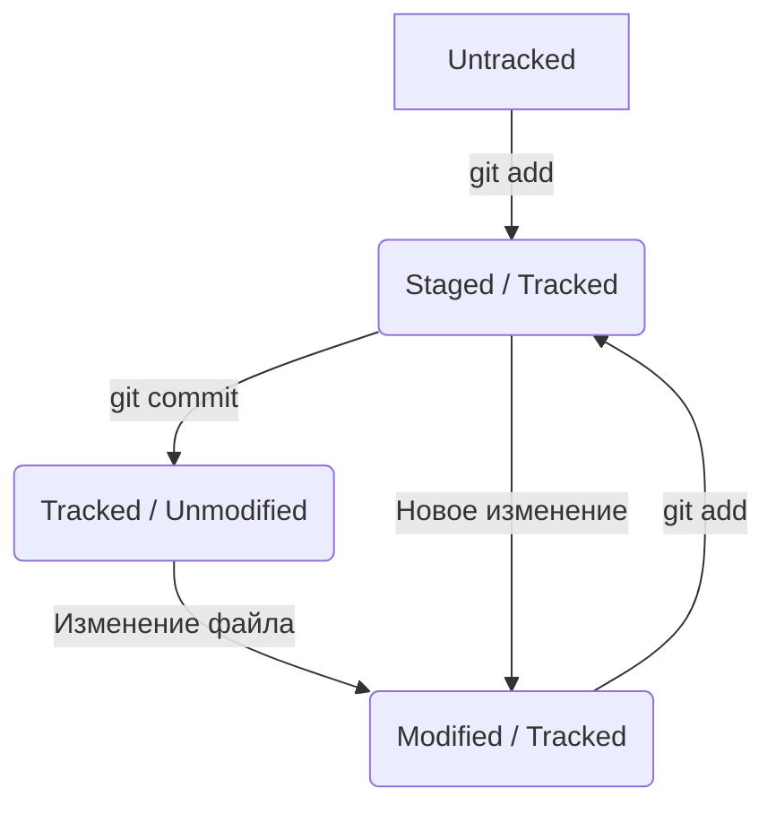

# Шпаргалка по Git

## Хеширование и информация о коммите
**Хеш** — основной идентификатор коммита. Git использует алгоритм **SHA-1**, который превращает данные в уникальную строку из 40 символов (цифры 0–9 и буквы a–f).

### Что входит в состав коммита:
*   **Дата и время** создания.
*   **Содержимое файлов** (снимок системы).
*   **Автор** (имя и email).
*   **Ссылка на родительский коммит** (parent).

### Свойства хеша:
1.  **Постоянство**: для одних и тех же данных хеш всегда будет одинаковым.
2.  **Чувствительность**: малейшее изменение в данных полностью меняет хеш.

> Все данные о соответствии «Хеш → Коммит» хранятся в скрытой папке `.git`.

## Режимы доступа (File Mode)
При коммите Git сохраняет не только содержимое, но и права доступа к файлу. В выводе команды вы можете увидеть строку вида `create mode 100644`.

### Что значат эти цифры?
*   **100**: Означает, что это обычный файл (не папка и не ссылка).
*   **644**: Права доступа в формате Unix (чтение и запись для владельца, только чтение для остальных).
*   **755**: Файл является исполняемым (скрипт или программа).

> На Windows Git эмулирует эти права, чтобы проект корректно работал при переносе на серверы Linux или macOS.


## Указатель HEAD
**HEAD** — это специальный указатель в Git, который определяет, на каком коммите вы сейчас находитесь.

*   Обычно HEAD указывает на последний коммит в текущей ветке.
*   Файлы, которые вы видите в своей рабочей папке — это именно то состояние, на которое смотрит HEAD.
*   При создании нового коммита HEAD автоматически перемещается вперёд на него.

**Как проверить, где сейчас HEAD?**
Файл с информацией о HEAD находится в `.git/HEAD`. Обычно там написано что-то вроде `ref: refs/heads/master`.

## Статусы и жизненный цикл файлов в Git

В Git каждый файл проходит через определённые этапы. Понимание этих статусов — ключ к работе без ошибок.

## Статусы и жизненный цикл файлов (Теория)

В Git файлы делятся на две основные категории: **отслеживаемые** (tracked) и **неотслеживаемые** (untracked).

### 1. Категории файлов
*   **untracked** (неотслеживаемый): Файл только что создан. Git видит его, но не следит за изменениями. У него нет истории.
*   **tracked** (отслеживаемый): Файл, который уже попадал в индекс (`git add`) или в коммит (`git commit`). Git следит за всеми изменениями в нем.

### 2. Состояния отслеживаемых (tracked) файлов
Внутри категории **tracked** файл может принимать следующие статусы:
*   **unmodified** (неизменённый): Состояние «по умолчанию» для файла, который уже есть в репозитории. Его версия на диске полностью совпадает с версией в последнем коммите.
*   **modified** (изменённый): После внесения правок в `unmodified` файл, его содержимое на диске отличается от того, что сохранено в последнем коммите или индексе.
*   **staged** (подготовленный): Файл добавлен в **staging area** (область подготовки) и ждёт команды `commit`.
    > 💡 **Staging area** также называют `index` или `cache`. В документации эти термины взаимозаменяемы.

> **Важно**: После выполннеия команды `git add` для `untracked` файла, он мгновенно становится `tracked` и переходит в состояние `staged`.

### Практический совет (Lifehack):
Если вы изменили файл, который уже раньше был в репозитории (как наш README.md), можно объединить add и commit в одну команду с помощью флага -a:
*   `git commit -a -m "Добавить раздел про выживание в Vim"`

### Типичный жизненный цикл (путь файла)
1. **Создание**: файл получает статус `untracked`.
2. **git add**: файл переходит в `staged` (и становится `tracked`).
3. **Изменение после add**: файл находится одновременно в `staged` (старая версия) и `modified` (новые правки).
4. **git commit**: файл зафиксирован в истории, его текущий статус — просто `tracked` (или `unmodified`).
5. **Новые правки**: файл снова становится `modified`.

### Схема жизненного цикла (Mermaid)



## История коммитов: git log
Команда `git log` отображает список всех коммитов в обратном хронологическом порядке.

### Полезные флаги:
*   `git log --oneline` — компактный вид (только короткий хеш и заголовок). Удобно, когда коммитов много.
*   `git log --graph` — рисует текстовое "дерево" веток (удобно для визуализации слияний).
*   `git log -n 3` — показать только последние 3 коммита.

### Формат сообщения к коммиту:
Хорошее сообщение должно быть относительно коротким и информативным:
1.  **Заголовок**: что сделано (до 72 символов).
2.  **Стиль**: Рекомендуется использовать повелительное наклонение ("Добавить", "Исправить") или прошедшее время ("Добавил", "Исправил") — главное, соблюдать единообразие во всём проекте.

## Начало работы с НОВЫМ проектом на GitHub
1. Создать пустой репо на сайте.
2. `git remote add origin <url>`
3. `git push -u origin main` (или другая ветка)

## Работа с удалённым репозиторием (Remote)

Для синхронизации локальной версии проекта с сервером (GitHub, GitLab и др.) используются специальные команды.

### Основные команды:
*   `git remote -v` — проверить, с каким удалённым репозиторием связан локальный проект (обычно он называется `origin`).
*   `git push` (от англ. *push* — «толкать») — отправить свои локальные коммиты на сервер.
    > Пример: `git push origin main` (отправить ветку main в репозиторий origin).
*   `git pull` (от англ. *pull* — «тянуть») — забрать изменения с сервера и сразу объединить их со своей локальной версией.
*   `git fetch` — просто «посмотреть», есть ли на сервере что-то новенькое, не скачивая сами изменения в файлы.

### Как это работает:
1. Вы делаете изменения локально.
2. Фиксируете их через `git add` и `git commit`.
3. Отправляете на сервер через `git push`, чтобы другие участники (или вы с другого ПК) могли их увидеть.

## Исправление последнего коммита (amend)

Иногда после коммита выясняется, что вы забыли добавить файл или допустили опечатку в сообщении. Чтобы не плодить лишние коммиты, можно «доложить» изменения в последний.

### Как использовать:
1. Внесите правки в файлы или создайте новые.
2. Добавьте их в индекс:
   ```bash
   git add <имя_файла>
3. git commit --amend --no-edit
```

--amend — говорит Git: «Возьми текущий индекс и объедини его с последним коммитом».
--no-edit — оставить прежнее сообщение коммита (не открывать редактор).

> **Важно**: --amend меняет хеш коммита. Используйте это только для коммитов, которые вы ещё не отправили на сервер (не делали push).

### Практический совет (Lifehack):
Если вы просто хотите **исправить опечатку в тексте сообщения** последнего коммита (не меняя файлы), просто введите:
```bash
git commit --amend -m "Новое правильное сообщение"
```

## Изменение сообщения последнего коммита

Если вы сделали коммит, но поняли, что в тексте сообщения ошибка или оно недостаточно информативно.

### Как использовать:
```bash
git commit --amend -m "Новое правильное сообщение"
```
*   **Что произойдёт**: Git создаст новый коммит с тем же содержимым, но с обновлённым текстом. Старый коммит будет заменён.
*   **Важное условие**: Это работает только для самого последнего коммита в вашей истории.
   ⚠️ Внимание: Как и любой amend, эта команда меняет хеш коммита. Если вы уже сделали push этого коммита на GitHub, исправлять его таким образом не рекомендуется (это создаст проблемы для коллег).

## Как убрать файл из индекса (Staging Area)

Если вы случайно добавили файл в индекс (`git add`), но передумали включать его в следующий коммит, его можно «вытащить» обратно в рабочую директорию.

### Как использовать:
```bash
git restore --staged <имя_файла>  - в git status файл красный (статус modified или untracked)
git restore --staged .    - Для всех файлов сразу
git rm --cached <имя_файла> - файл станет untracked
```

### Сравнение git restore и git rm --cached

Если вы добавили лишний файл через `git add`, есть два способа это исправить в зависимости от цели:

### 1. git restore --staged <file>
**Когда использовать:** Вы просто передумали включать файл в этот коммит, но хотите, чтобы Git продолжал его отслеживать (**tracked**).
* **Результат:** Файл перемещается из `Staged` обратно в `Modified`. В следующем коммите его не будет, но в истории он останется.

### 2. git rm --cached <file>
**Когда использовать:** Вы случайно добавили файл, который вообще не должен быть в репозитории (например, конфиг с паролем или огромный лог).
* **Результат:** Git полностью **перестает отслеживать** этот файл (**untracked**). При этом сам файл остается на вашем диске, но для Git он становится «невидимкой».

> 💡 **Совет**: Если вы использовали `git rm --cached`, не забудьте сразу добавить этот файл в `.gitignore`, чтобы случайно не добавить его снова.


## Cравнение git restore и git rm --cached

## Игнорирование файлов (.gitignore)

В каждом проекте есть файлы, которые не должны попадать в репозиторий: пароли, временные логи, папки с библиотеками или системные файлы (типа `.DS_Store`).

### Как это работает:
1. Создайте в корне проекта файл с названием `.gitignore`.
2. Запишите в него названия файлов или шаблоны.

### Примеры правил в .gitignore:
*   `secret.txt` — игнорировать конкретный файл.
*   `*.log` — игнорировать все файлы с расширением `.log`.
*   `temp/` — игнорировать всю папку `temp`.
*   `!important.log` — исключение: игнорировать все лог-файлы, кроме этого.

> 💡 **Важно**: `.gitignore` работает только для файлов, которые еще **не были** добавлены в репозиторий. Если файл уже закоммичен, его сначала нужно удалить из индекса (`git rm --cached`).

## Отмена изменений в рабочей директории

Если вы внесли правки в файл (статус `modified`), но хотите их полностью удалить и вернуть файл к состоянию последнего коммита.

### Как использовать:
```bash
git restore <имя_файла>
git restore .    - Для всех файлов в папке
```

*   **Что произойдёт**: Git возьмёт версию файла из последнего коммита и перезапишет ею текущий файл на диске. Все правки, которые вы сохраняли в редакторе (Ctrl+S), но не успели закоммитить, будут стёрты.

## Работа в консольном редакторе (Nano)
Если вы правите файлы прямо в терминале через `nano`:
* **Ctrl + O** — сохранить (записать) изменения, не выходя.
* **Ctrl + X** — выйти из редактора.
* **Y** (после Ctrl + X) — подтвердить сохранение перед выходом.
* **N** (после Ctrl + X) — выйти без сохранения (откатить правки).

## Автодополнение (клавиша Tab)
В Git Bash и других терминалах можно использовать клавишу **Tab** для автоматического завершения команд, имен файлов и флагов.

### Как это работает:
1. Начните вводить команду, например: `git diff --sta`.
2. Нажмите **Tab**.
3. Git Bash сам допишет слово до `--staged`.

### Полезные функции:
*   **Одинарный Tab**: Дописывает команду или имя файла, если вариант только один.
*   **Двойной Tab**: Если вариантов несколько (например, несколько файлов на букву "R"), двойное нажатие покажет список всех подходящих вариантов.

> 💡 Это защищает от ошибок вроде `git commit --amend --no-edit` — длинные флаги проще «табать», чем печатать вручную.

## Выйти из режима END
* **q (англ. Quit - выход) вернёт вас к обычной строке ввода $.

## Выживание в редакторе Vim
Vim — это стандартный редактор в Git Bash. У него есть два основных режима: **командный** (по умолчанию) и **вставки** (для набора текста).

### Как пользоваться:
1. **Нажать `i`** (insert) — переход в режим ввода текста. Теперь можно писать сообщение коммита.
2. **Нажать `Esc`** — выход из режима ввода текста обратно в командный режим.
3. **Набрать `:wq`** (write + quit) и нажать **Enter** — сохранить изменения и выйти.
4. **Набрать `:q!`** (quit!) и нажать **Enter** — выйти БЕЗ сохранения (отменить коммит).

> 💡 Если вы «зависли» и не понимаете, что происходит — жмите `Esc` несколько раз, а затем `:q!`.

## Коммит через внешний редактор (Блокнот)
Если после `git commit` открылся Блокнот:
1. Напишите сообщение в первой строке.
2. Сохраните (Ctrl + S).
3. **Обязательно закройте окно Блокнота**, иначе Git "зависнет" в ожидании!

*Неудавшийся Test Vim*
При вводе команд git commit (git commit --amend) без флагов открывается не Vim, а внешний редактор (Блокнот).
Это значит, что в Windows-версии Git он настроен как редактор по умолчанию. 
Если всё-таки хотите именно Vim, введите:
`git config --global core.editor "vim"`


## Принудительная отправка (git push --force)
Команда, которая заставляет удалённый сервер принять вашу версию истории, даже если хеши коммитов разошлись.

### Когда использовать:
*   После использования `git commit --amend` для коммита, который уже был на GitHub.
*   Если вы переписали историю (например, через `rebase`).

> ⚠️ **ОПАСНО**: В командных проектах `--force` может затереть работу коллег. Используйте только в личных ветках!

## Смена редактора коммитов

Если вам неудобно писать сообщения в Vim или Блокноте, можно назначить свой любимый редактор.

### Команды настройки:
*   **Nano**: `git config --global core.editor "nano"`
*   **Vim**: `git config --global core.editor "vim"`
*   **VS Code**: `git config --global core.editor "code --wait"`
*   **Sublime Text**: `git config --global core.editor "subl -n -w"`
*   **Notepad++**: `git config --global core.editor "'C:/Program Files/Notepad++/notepad++.exe' -multiInst -nosession -notabbar"`

### Служебные команды:
*   **Проверить текущий редактор**: `git config --show-origin core.editor`
*   **Сбросить до системного**: `git config --global --unset core.editor`

> **Важно**: флаги --wait (в VS Code и IDEA) и -w (в Sublime) говорят Git: «Не завершай коммит, пока я не закрою вкладку с сообщением». Без них Git попытается прочитать пустой файл сразу после открытия редактора.

## Откат к конкретному коммиту (git reset)

Команда позволяет мгновенно вернуть репозиторий к состоянию любого коммита из прошлого по его хешу.

### Как использовать:
```bash
git reset --hard <hash>
```
Что произойдёт:
История: Все коммиты, которые были сделаны после указанного хеша, будут стерты из текущей ветки.
Индекс (Staged): Область подготовки будет полностью очищена.
Рабочая директория: Все ваши несохраненные правки в файлах будут удалены безвозвратно. Файлы станут точно такими, какими они были в тот момент прошлого.

⚠️ ВНИМАНИЕ: Это опасная операция. Вы потеряете все изменения, которые не были закоммичены. Используйте только если точно уверены, что текущая работа вам больше не нужна.

### Когда это полезно?
Если вы зашли в тупик, наворотили кучу ошибок и хотите просто «начать с того места, где вчера всё работало».

### Вариант «Помягче» (Soft Reset):
Если вы хотите удалить коммит, но **оставить все правки в файлах** (чтобы переделать коммит по-другому), используйте:
```bash
git reset --soft <hash>
```
Правки останутся в индексе (staged), и вы ничего не потеряете.

## История изменений конкретного файла

Если вам нужно узнать, кто и когда менял только один определённый файл, используйте фильтр по пути.

### Как использовать:
```bash
git log -- <путь_к_файлу>
```
Полезные комбинации:
git log --oneline -- README.md — компактная история изменений только для файла README.md.
git log -p -- <file> — показать не только коммиты, но и конкретные изменения кода (diff) внутри этого файла для каждого шага истории.
💡 Важно: Два тире -- отделяют опции команды от путей к файлам. Это помогает Git понять, что дальше идёт именно имя файла, а не название ветки.

## Продвинутая навигация и поиск. Работа с историей и «путешествия во времени»

### Просмотр изменений внутри файла
* `git show <hash>` — посмотреть изменения, сделанные в конкретном коммите (какие строки добавлены `+`, а какие удалены `-`).
* `git log -p -- <путь_к_файлу>` — показать историю изменений конкретного файла с деталями (что именно добавили `+` или удалили `-`).
  > ⚠️ Пробел после `--` обязателен!
* `git log --reverse` — показать историю в хронологическом порядке (от старых к новым).
* `git log --all` — показать коммиты во всех ветках сразу.

### Навигация в длинных списках (режим Pager)
Если вывод команды не влезает в экран (внизу горит `:` или `(END)`):
* **Пробел** — листать вниз на страницу.
* **b** — листать вверх на страницу.
* **g** — прыгнуть в самое начало.
* **G** — прыгнуть в самый конец.
* **q** — выйти из режима просмотра (вернуться в консоль).

### Перемещение по истории (Checkout)
* `git checkout <hash>` — временно переключить все файлы проекта к состоянию на момент этого коммита.
  > 💡 Это переводит Git в режим **Detached HEAD** (англ. оторванная голова, режим «просмотра»).
* `git checkout main` — вернуться из прошлого в основную ветку.

## Работа с удалёнными репозиториями (Remote)

Локальный проект может быть связан с несколькими серверами одновременно.

### Команды синхронизации:
* `git remote -v` — проверить список всех привязанных адресов.
* `git remote add <имя> <url>` — добавить новый адрес (например, `upstream` для оригинала проекта).
* `git remote remove <имя>` — удалить связь с сервером.
* `git push -u origin main` — отправить коммиты на сервер и «связать» ветки (флаг `-u` нужен только один раз).
* `git push --force` — **(ОПАСНО)** принудительно обновить историю на сервере (нужно после `commit --amend`).

### Получение обновлений:
* `git fetch <имя>` — подтянуть данные с сервера, не меняя свои файлы.
* `git pull <имя> <ветка>` — скачать изменения и сразу объединить их со своей версией.

## Связать Git и GitHub

Вы склонировали репозиторий из чужого аккаунта (PraktikumJava/git-hints.git). GitHub не позволяет сторонним пользователям записывать данные (push) напрямую в чужие учебные проекты.

* Как это исправить (2 способа):

### Способ №1: Создать свой репозиторий (рекомендуется)

Если вы хотите, чтобы эта шпаргалка была в вашем аккаунте KonstantinP63:

1. Зайдите на GitHub и нажмите `New repository`.
2. Назовите его `my-git-hints`.
3. Скопируйте ссылку на него (кнопка Code -> HTTPS).

4. В терминале переназначьте адрес «удаленного сервера»:
* `git remote set-url origin https://github.com`
5. Снова сделайте:
* `git push origin main`

### Способ №2: Сделать Fork (если так просят в задании)

1. На странице https://github.com нажмите кнопку Fork (вверху справа).
2. GitHub создаст копию этого проекта в вашем аккаунте.
3. Повторите шаги 4 и 5 из первого способа, указав ссылку на ваш форк.

* Что произошло?
Git пытался отправить изменения в «защищенное хранилище» Яндекса (Практикума), а у вас есть права только на свое собственное.

* При создании нового репозитория на GitHub вы увидите несколько полей. Вот что они значат и что в них стоит писать для вашей шпаргалки:
1. Description (Описание) — по желанию. Это краткое пояснение, о чем ваш проект. 
2. Configuration (Настройки доступа) - Public или Private.
3. Initialize this repository with (Инициализация) 

> **ВАЖНО**
Так как у вас уже есть готовый проект на компьютере, в этой секции ничего не отмечайте:
* НЕ ставьте галочку Add a README file.
* НЕ ставьте галочку Add .gitignore.
* НЕ выбирайте лицензию.

**Почему?** Если вы создадите репозиторий с файлом README на сайте, у него появится своя история (первый коммит). Когда вы попытаетесь отправить туда свою локальную шпаргалку, Git увидит два разных проекта и выдаст ошибку «unrelated histories».

* Что делать после нажатия кнопки «Create repository»?
GitHub откроет страницу с инструкциями. 
Вам нужна секция «...or push an existing repository from the command line».

Выполните эти три команды в своем терминале (находясь в папке git-hints):
1. Меняем адрес сервера на ваш личный:
* `git remote set-url origin https://github.com` - в ссылке ваше имя пользователя
2. Убеждаемся, что ветка называется main (на всякий случай):
* `git branch -M main` 
3. Отправляем данные:
* `git push -u origin main` - Флаг -u свяжет вашу локальную ветку с веткой на сервере навсегда.

После нажатия «Create» на GitHub "Start with a template" (англ. "Начните с шаблона").

Секция «Start with a template» (Начать с шаблона) на GitHub — это удобная штука, когда вы хотите создать проект на базе уже готовой структуры (например, стандартного сайта или приложения), которую кто-то подготовил заранее.
Что это значит для вас сейчас?
Вам это НЕ нужно. ❌
Цель — загрузить уже готовую шпаргалку. Шаблон создаст в новом репозитории свои файлы и свою историю коммитов, которые будут конфликтовать с вашей локальной историей.
* Как поступить правильно:
1. Оставьте в поле Repository template значение «No template» (оно стоит по умолчанию).
Введите только Repository name (например, my-git-hints).
Убедитесь, что Description (по желанию) заполнено, а переключатель стоит на Public.

> **Важно**: Внизу, под заголовком «Initialize this repository with», не ставьте ни одной галочки (ни README, ни .gitignore).

2. Нажимайте зелёную кнопку «Create repository».

* Что будет после нажатия кнопки:
GitHub откроет страницу с черным фоном и списком команд. Вам не нужно копировать их все. Просто выполните в своём терминале (в папке git-hints) те, что мы обсуждали:
bash
# 1. Привязываем ваш новый личный адрес (подставьте свой логин и имя репо)
* git remote set-url origin https://github.com

# 2. Отправляем всё на сервер
* git push -u origin main

* Нет чёрного фона. На белом фоне открылось:my-git-hintsДалее 2 окна:'Set up GitHub Copilot' и 'Add collaborators to this repository' На голубом фоне:Quick setup — if you’ve done this kind of thing beforeSet up in desktop or HTTPS SSH (с возможностью копирования ссылок)Get started by creating a new file or uploading an existing file. We recommend every repository include a README, LICENSE, and .gitignore....or create a new repository on the command lineecho "# my-git-hints" >> README.mdgit initgit add README.mdgit commit -m "first commit"git branch -M maingit remote add origin https://github.com/KonstantinP63/my-git-hints.gitgit push -u origin main...or push an existing repository from the command linegit remote add origin https://github.com/KonstantinP63/my-git-hints.gitgit branch -M maingit push -u origin main

У нас уже есть готовая папка с историей коммитов на компьютере, нам подходит секция 

«…or push an existing repository from the command line».

Выполните эти команды в терминале (в папке git-hints):

1. Сначала удалим старую привязку (которая вела на чужой репозиторий Практикума):
* git remote remove origin

2. Привяжем ваш новый личный репозиторий:
* git remote add origin https://github.com/KonstantinP63/my-git-hints.git

3. Установим ветку main как главную:
* git branch -M main

4. Отправим все ваши коммиты на GitHub:
bash
git push -u origin main

* Что должно произойти:
* Git должен показать процесс загрузки (Counting objects, Delta compression и т.д.). 
* После этого обновите страницу в браузере (нажмите F5), и увидите свою загрузку.

** Команды пунктов 2, 3, 4 можно скопировать из GitHub и ввести одновременно.

* Что произойдет при вставке:
1. Git добавит адрес вашего репозитория (remote).
2. Переименует текущую ветку из master в main.
3. Попытается отправить данные. В этот момент он может попросить вас подтвердить вход через браузер.
> **Важно**: 
* Перед этим убедитесь, что вы сделали хотя бы один коммит (git add + git commit), иначе третья команда (push) выдаст ошибку, так как ей нечего будет отправлять.

## Ветки (Branches)

Ветки позволяют работать над разными частями проекта (фичами или исправлениями) одновременно, не ломая основной код.

### Основные команды:
* `git branch <имя_ветки>` — создать новую ветку от текущего места.
* `git checkout <имя_ветки>` (или `git switch`) — переключиться на другую ветку.
  > 💡 **Магия Git**: При переключении Git физически перезаписывает файлы в папке, подставляя версию из выбранной ветки.
* `git checkout -b <имя_ветки>` — создать новую ветку и сразу переключиться на неё.
* `git branch` — посмотреть список всех локальных веток (текущая отмечена `*`).
* `git branch -d <имя_ветки>` — удалить ветку (после того, как она была слита с основной).

### Визуализация истории:
* `git log --oneline --all --graph` — нарисовать «дерево» коммитов. Показывает, где ветки разошлись и в каком состоянии они сейчас.

### Важные правила:
1. **Разделение миров**: Пока вы не сделали `commit`, изменения «гуляют» вместе с вами по веткам. Только коммит закрепляет правки за конкретной веткой.
2. **Слияние**: Чтобы объединить наработки из ветки `feature` в `main`, нужно перейти в `main` и выполнить `git merge feature`.

## Разрешение конфликтов (Merge Conflicts)

Конфликт возникает, когда в двух сливаемых ветках изменены одни и те же строки одного и того же файла.

### Как распознать конфликт:
1. Git выдает сообщение: `CONFLICT (content): Merge conflict in <file>`.
2. В терминале появляется статус `(master|MERGING)`.

### Анатомия конфликта в файле:
Git помечает проблемные места специальными маркерами:
* `<<<<<<< HEAD` — начало ваших изменений (в текущей ветке).
* `=======` — разделитель между вашей и «чужой» версией.
* `>>>>>>> branch-name` — конец изменений из вливаемой ветки.

### Как исправить:
1. Открыть файл и **вручную** решить, какой текст оставить (можно объединить оба варианта).
2. **Удалить** все маркеры (`<<<<`, `====`, `>>>>`).
3. Сохранить файл.
4. Выполнить `git add <file>` (сообщить Git, что конфликт решён).
5. Выполнить `git commit` для завершения слияния.

## Удаление веток (Cleanup)

После успешного слияния (`merge`) ветка-черновик больше не нужна. Её можно безопасно удалить.

### Основные команды:
* `git branch -d <имя_ветки>` — **безопасное удаление** (soft delete). Git удалит ветку только в том случае, если она была полностью слита с текущей. Если в ветке остались незакоммиченные или неслитые изменения, Git выдаст предупреждение.
   Git должен ответить: Deleted branch bugfix/fix-branch (was 3823269).

* `git branch -D <имя_ветки>` — **принудительное удаление** (force delete). Используется, когда нужно выкинуть ветку вместе со всеми экспериментами, которые не пошли в основной проект.

### Удаление на сервере (GitHub):
* `git push origin --delete <имя_ветки>` — удалить ветку из удалённого репозитория.

> ⚠️ **Важно**: Вы не можете удалить ветку, в которой сейчас находитесь. Сначала переключитесь на `main` или любую другую ветку.

## Синхронизация веток с сервером
Новые ветки создаются только локально. Чтобы они появились на GitHub:
* `git push -u origin <имя_ветки>` — отправить ветку на сервер и связать её с локальной.
* `git branch -a` — посмотреть все ветки (белые — локальные, красные/remote — на сервере).

## Временное сохранение (git stash)

Используется, когда нужно срочно переключить ветку, но текущие изменения ещё не готовы для коммита.

### Основные команды:
* `git stash` — «спрятать» все незакоммиченные изменения (из индекса и рабочей директории) в секретный карман. Файлы в папке станут чистыми (как в последнем коммите).
* `git stash list` — посмотреть список всех сохранённых «заначек».
* `git stash apply` — достать последние изменения из заначки и применить их к текущей ветке (заначка при этом останется в списке).
* `git stash pop` — «выстрелить» заначкой: достать изменения и сразу удалить их из списка тайников. Самый частый вариант.
* `git stash drop` — просто удалить заначку, если она больше не нужна.
* `git stash clear` — полностью очистить весь список заначек.

> 💡 **Совет**: Если у тебя несколько заначек, используй `git stash save "описание"`, чтобы потом не гадать, где что лежит.
 
## Правильное клонирование (git clone)
Команда `git clone <url>` автоматически создает папку с именем репозитория. 
* **Ошибка**: Создавать папку вручную и клонировать внутрь неё (получится "матрешка").
* **Правильно**: Запустить команду из родительской папки (например, из `~/dev/`), а затем зайти в созданную папку через `cd`.

## Как читать граф после слияния (Merge Graph)

Когда вы видите `*` с двумя входящими линиями (`|\`) — это **Merge Commit** (коммит слияния).

### Ключевые символы в `git log --graph`:
*   `*` — точка (коммит), где зафиксированы изменения.
*   `|` — вертикальная линия (жизнь одной ветки).
*   `\` или `/` — создание новой ветки или её вливание обратно.
*   `(HEAD -> main)` — ваше текущее местоположение. Все, что ниже этой точки — это прошлое.

> 💡 **Совет**: Если после `git merge` вы видите, что ветка `origin/feature` соединилась линией с вашим `main`, значит, слияние прошло успешно и код объединен.

## HTTPS vs SSH
* **HTTPS** (рекомендуется для начала): Ссылки вида `https://github.com...`. Авторизация через браузер.
* **SSH**: Ссылки вида `git@github.com:...`. Требует настройки SSH-ключей в системе.

## Работа через SSH (SSH-ключи)
Позволяет отправлять код без ввода логина/пароля в браузере.
* Ссылка репозитория: `git@github.com:username/repo.git`
* **Проверка связи**: `ssh -T git@github.com`
* **Смена протокола с HTTPS на SSH**: `git remote set-url origin git@github.com:user/repo.git`

## Проверка и смена протокола (HTTPS -> SSH)
Если репозиторий уже создан, но нужно перейти на SSH:
1. Проверить текущий URL: `git remote -v`
2. Сменить на SSH: `git remote set-url origin git@github.com:USER/REPO.git`
3. Проверить связь: `ssh -T git@github.com` (должно выдать "Hi username! You've successfully authenticated").


## Переезд в новый репозиторий (Remote Change)
Если нужно перепривязать локальный проект к другому (например, приватному) репозиторию:
1. Сменить URL: `git remote set-url origin git@github.com:USER/NEW-REPO.git`
2. Отправить ветку: `git push -u origin main`
3. Отправить все остальные ветки: `git push --all origin`

## Команды, выполняемые в терминале и на GitHub.
* **Локально (в терминале *внутри* папки проекта)**: создание веток, редактирование файлов, `add`, `commit`, `merge`, `status`, `log`.
    ИСКЛЮЧЕНИЕ (в терминале *в родительской* папке проекта)**: clone.
* **На GitHub (в браузере)**: просмотр кода, создание Pull Request, удаление репозитория, настройка прав доступа.

## 🌴 Работа с ветками и удаленным репозиторием
* git push origin <имя_ветки> — отправить указанную ветку на GitHub.
  Фишка: Необязательно переключаться на ветку, чтобы её запушить. Можно находиться в main и отправить feature, просто указав её имя.
* git push -u origin <имя_ветки> — отправить ветку и «привязать» её к удаленной (установить upstream). После этого можно использовать просто git push.
* git branch -d <имя_ветки> — удалить локальную ветку (делать после слияния). 

## 🤝 Совместная работа (Pull Request)
* Pull Request (PR) — это не команда Git, а функция GitHub для проверки кода перед слиянием. 
* Типовой процесс (Workflow):
1. Создать ветку: git checkout -b feature/name.
2. Внести изменения: git add . и git commit -m "...".
3. Запушить: git push origin feature/name.
4. Открыть PR: На GitHub нажать "Compare & pull request", выбрать базовую ветку (main) и сравнить со своей.
5. Слияние (Merge): После проверки нажать "Merge pull request" в интерфейсе GitHub. 

## 🔄 Синхронизация
* git push - отправить код на сервер.
* git pull — забрать изменения с сервера (из облака) и сразу влить в текущую ветку (сочетает fetch и merge).
* git fetch — только скачать данные из облака, ничего не меняя в ваших файлах. 
