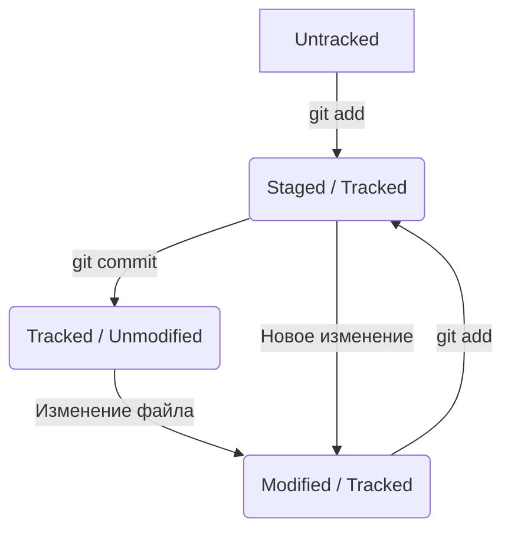

# Шпаргалка по Git

## Хеширование и информация о коммите
**Хеш** — основной идентификатор коммита. Git использует алгоритм **SHA-1**, который превращает данные в уникальную строку из 40 символов (цифры 0–9 и буквы a–f).

### Что входит в состав коммита:
*   **Дата и время** создания.
*   **Содержимое файлов** (снимок системы).
*   **Автор** (имя и email).
*   **Ссылка на родительский коммит** (parent).

### Свойства хеша:
1.  **Постоянство**: для одних и тех же данных хеш всегда будет одинаковым.
2.  **Чувствительность**: малейшее изменение в данных полностью меняет хеш.

> Все данные о соответствии «Хеш → Коммит» хранятся в скрытой папке `.git`.

## Режимы доступа (File Mode)
При коммите Git сохраняет не только содержимое, но и права доступа к файлу. В выводе команды вы можете увидеть строку вида `create mode 100644`.

### Что значат эти цифры?
*   **100**: Означает, что это обычный файл (не папка и не ссылка).
*   **644**: Права доступа в формате Unix (чтение и запись для владельца, только чтение для остальных).
*   **755**: Файл является исполняемым (скрипт или программа).

> На Windows Git эмулирует эти права, чтобы проект корректно работал при переносе на серверы Linux или macOS.


## Указатель HEAD
**HEAD** — это специальный указатель в Git, который определяет, на каком коммите вы сейчас находитесь.

*   Обычно HEAD указывает на последний коммит в текущей ветке.
*   Файлы, которые вы видите в своей рабочей папке — это именно то состояние, на которое смотрит HEAD.
*   При создании нового коммита HEAD автоматически перемещается вперёд на него.

**Как проверить, где сейчас HEAD?**
Файл с информацией о HEAD находится в `.git/HEAD`. Обычно там написано что-то вроде `ref: refs/heads/master`.

## Статусы и жизненный цикл файлов в Git

В Git каждый файл проходит через определённые этапы. Понимание этих статусов — ключ к работе без ошибок.

## Статусы и жизненный цикл файлов (Теория)

В Git файлы делятся на две основные категории: **отслеживаемые** (tracked) и **неотслеживаемые** (untracked).

### 1. Категории файлов
*   **untracked** (неотслеживаемый): Файл только что создан. Git видит его, но не следит за изменениями. У него нет истории.
*   **tracked** (отслеживаемый): Файл, который уже попадал в индекс (`git add`) или в коммит (`git commit`). Git следит за всеми изменениями в нем.

### 2. Состояния отслеживаемых (tracked) файлов
Внутри категории **tracked** файл может принимать следующие статусы:
*   **unmodified** (неизменённый): Состояние «по умолчанию» для файла, который уже есть в репозитории. Его версия на диске полностью совпадает с версией в последнем коммите.
*   **modified** (изменённый): После внесения правок в `unmodified` файл, его содержимое на диске отличается от того, что сохранено в последнем коммите или индексе.
*   **staged** (подготовленный): Файл добавлен в **staging area** (область подготовки) и ждёт команды `commit`.
    > 💡 **Staging area** также называют `index` или `cache`. В документации эти термины взаимозаменяемы.

> **Важно**: После выполннеия команды `git add` для `untracked` файла, он мгновенно становится `tracked` и переходит в состояние `staged`.


### Типичный жизненный цикл (путь файла)
1. **Создание**: файл получает статус `untracked`.
2. **git add**: файл переходит в `staged` (и становится `tracked`).
3. **Изменение после add**: файл находится одновременно в `staged` (старая версия) и `modified` (новые правки).
4. **git commit**: файл зафиксирован в истории, его текущий статус — просто `tracked` (или `unmodified`).
5. **Новые правки**: файл снова становится `modified`.

### Схема жизненного цикла (Mermaid)



## История коммитов: git log
Команда `git log` отображает список всех коммитов в обратном хронологическом порядке.

### Полезные флаги:
*   `git log --oneline` — компактный вид (только короткий хеш и заголовок). Удобно, когда коммитов много.
*   `git log --graph` — рисует текстовое "дерево" веток (удобно для визуализации слияний).
*   `git log -n 3` — показать только последние 3 коммита.

### Формат сообщения к коммиту:
Хорошее сообщение должно быть относительно коротким и информативным:
1.  **Заголовок**: что сделано (до 72 символов).
2.  **Стиль**: Рекомендуется использовать повелительное наклонение ("Добавить", "Исправить") или прошедшее время ("Добавил", "Исправил") — главное, соблюдать единообразие во всём проекте.

## Работа с удалённым репозиторием (Remote)

Для синхронизации локальной версии проекта с сервером (GitHub, GitLab и др.) используются специальные команды.

### Основные команды:
*   `git remote -v` — проверить, с каким удалённым репозиторием связан локальный проект (обычно он называется `origin`).
*   `git push` (от англ. *push* — «толкать») — отправить свои локальные коммиты на сервер.
    > Пример: `git push origin main` (отправить ветку main в репозиторий origin).
*   `git pull` (от англ. *pull* — «тянуть») — забрать изменения с сервера и сразу объединить их со своей локальной версией.
*   `git fetch` — просто «посмотреть», есть ли на сервере что-то новенькое, не скачивая сами изменения в файлы.

### Как это работает:
1. Вы делаете изменения локально.
2. Фиксируете их через `git add` и `git commit`.
3. Отправляете на сервер через `git push`, чтобы другие участники (или вы с другого ПК) могли их увидеть.

## Исправление последнего коммита (amend)

Иногда после коммита выясняется, что вы забыли добавить файл или допустили опечатку в сообщении. Чтобы не плодить лишние коммиты, можно «доложить» изменения в последний.

### Как использовать:
1. Внесите правки в файлы или создайте новые.
2. Добавьте их в индекс:
   ```bash
   git add <имя_файла>
3. git commit --amend --no-edit

--amend — говорит Git: «Возьми текущий индекс и объедини его с последним коммитом».
--no-edit — оставить прежнее сообщение коммита (не открывать редактор).

Важно: --amend меняет хеш коммита. Используйте это только для коммитов, которые вы ещё не отправили на сервер (не делали push).

### Практический совет (Lifehack):
Если вы просто хотите **исправить опечатку в тексте сообщения** последнего коммита (не меняя файлы), просто введите:
```bash
git commit --amend -m "Новое правильное сообщение"

## Отмена индексации (Unstaging)

Если вы случайно добавили файл в индекс (`git add`), но передумали включать его в следующий коммит, его можно «вытащить» обратно в рабочую директорию.

### Как использовать:
```bash
git restore --staged <имя_файла>  - в git status файд красный (статус modified или untracked)
git restore --staged .    - Для всех файлов сразу

## Игнорирование файлов (.gitignore)

В каждом проекте есть файлы, которые не должны попадать в репозиторий: пароли, временные логи, папки с библиотеками или системные файлы (типа `.DS_Store`).

### Как это работает:
1. Создайте в корне проекта файл с названием `.gitignore`.
2. Запишите в него названия файлов или шаблоны.

### Примеры правил в .gitignore:
*   `secret.txt` — игнорировать конкретный файл.
*   `*.log` — игнорировать все файлы с расширением `.log`.
*   `temp/` — игнорировать всю папку `temp`.
*   `!important.log` — исключение: игнорировать все лог-файлы, кроме этого.

> 💡 **Важно**: `.gitignore` работает только для файлов, которые еще **не были** добавлены в репозиторий. Если файл уже закоммичен, его сначала нужно удалить из индекса (`git rm --cached`).

## Отмена изменений в рабочей директории

Если вы внесли правки в файл (статус `modified`), но хотите их полностью удалить и вернуть файл к состоянию последнего коммита.

### Как использовать:
```bash
git restore <имя_файла>
git restore .    - Для всех файлов в папке

*   **Что произойдёт**: Git возьмёт версию файла из последнего коммита и перезапишет ею текущий файл на диске. Все правки, которые вы сохраняли в редакторе (Ctrl+S), но не успели закоммитить, будут стёрты.
