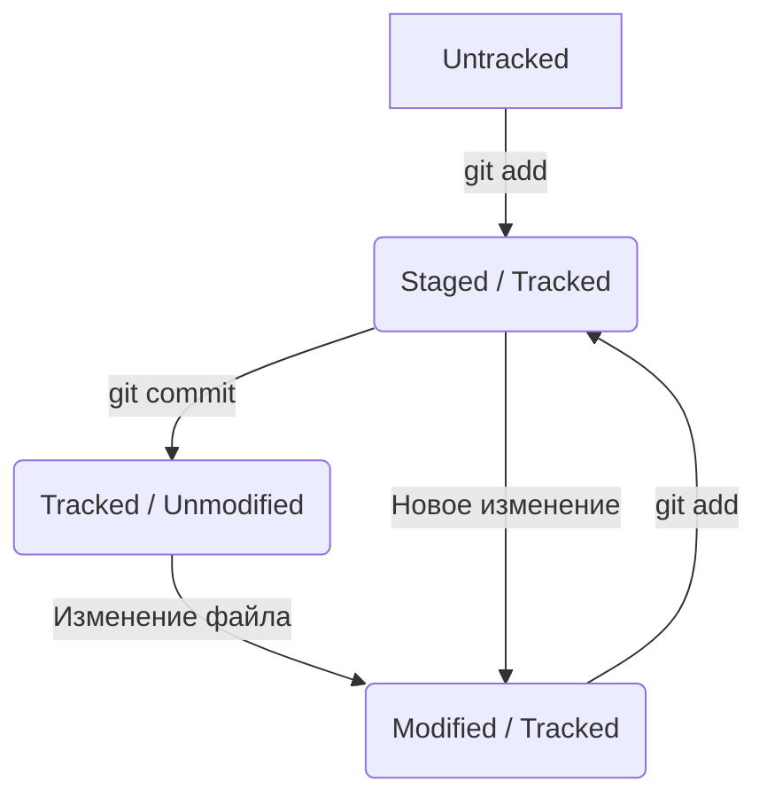

# Шпаргалка по Git

## Хеширование и информация о коммите
**Хеш** — основной идентификатор коммита. Git использует алгоритм **SHA-1**, который превращает данные в уникальную строку из 40 символов (цифры 0–9 и буквы a–f).

### Что входит в состав коммита:
*   **Дата и время** создания.
*   **Содержимое файлов** (снимок системы).
*   **Автор** (имя и email).
*   **Ссылка на родительский коммит** (parent).

### Свойства хеша:
1.  **Постоянство**: для одних и тех же данных хеш всегда будет одинаковым.
2.  **Чувствительность**: малейшее изменение в данных полностью меняет хеш.

> Все данные о соответствии «Хеш → Коммит» хранятся в скрытой папке `.git`.

## Указатель HEAD
**HEAD** — это специальный указатель в Git, который определяет, на каком коммите вы сейчас находитесь.

*   Обычно HEAD указывает на последний коммит в текущей ветке.
*   Файлы, которые вы видите в своей рабочей папке — это именно то состояние, на которое смотрит HEAD.
*   При создании нового коммита HEAD автоматически перемещается вперёд на него.

**Как проверить, где сейчас HEAD?**
Файл с информацией о HEAD находится в `.git/HEAD`. Обычно там написано что-то вроде `ref: refs/heads/master`.

## Статусы и жизненный цикл файлов в Git

В Git каждый файл проходит через определённые этапы. Понимание этих статусов — ключ к работе без ошибок.

## Статусы и жизненный цикл файлов (Теория)

В Git файлы делятся на две основные категории: **отслеживаемые** (tracked) и **неотслеживаемые** (untracked).

### 1. Категории файлов
*   **untracked** (неотслеживаемый): Файл только что создан. Git видит его, но не следит за изменениями. У него нет истории.
*   **tracked** (отслеживаемый): Файл, который уже попадал в индекс (`git add`) или в коммит (`git commit`). Git следит за всеми изменениями в нем.

### 2. Состояния отслеживаемых (tracked) файлов
Внутри категории **tracked** файл может принимать следующие статусы:
*   **unmodified** (неизменённый): Состояние «по умолчанию» для файла, который уже есть в репозитории. Его версия на диске полностью совпадает с версией в последнем коммите.
*   **modified** (изменённый): После внесения правок в `unmodified` файл, его содержимое на диске отличается от того, что сохранено в последнем коммите или индексе.
*   **staged** (подготовленный): Файл добавлен в **staging area** (область подготовки) и ждёт команды `commit`.
    > 💡 **Staging area** также называют `index` или `cache`. В документации эти термины взаимозаменяемы.

> **Важно**: После выполннеия команды `git add` для `untracked` файла, он мгновенно становится `tracked` и переходит в состояние `staged`.

### Типичный жизненный цикл (путь файла)
1. **Создание**: файл получает статус `untracked`.
2. **git add**: файл переходит в `staged` (и становится `tracked`).
3. **Изменение после add**: файл находится одновременно в `staged` (старая версия) и `modified` (новые правки).
4. **git commit**: файл зафиксирован в истории, его текущий статус — просто `tracked` (или `unmodified`).
5. **Новые правки**: файл снова становится `modified`.

### Схема жизненного цикла (Mermaid)

## История коммитов: git log
Команда `git log` отображает список всех коммитов в обратном хронологическом порядке.

### Полезные флаги:
*   `git log --oneline` — компактный вид (только короткий хеш и заголовок). Удобно, когда коммитов много.
*   `git log --graph` — рисует текстовое "дерево" веток (удобно для визуализации слияний).
*   `git log -n 3` — показать только последние 3 коммита.

### Формат сообщения к коммиту:
Хорошее сообщение должно быть относительно коротким и информативным:
1.  **Заголовок**: что сделано (до 72 символов).
2.  **Стиль**: Рекомендуется использовать повелительное наклонение ("Добавить", "Исправить") или прошедшее время ("Добавил", "Исправил") — главное, соблюдать единообразие во всём проекте.
